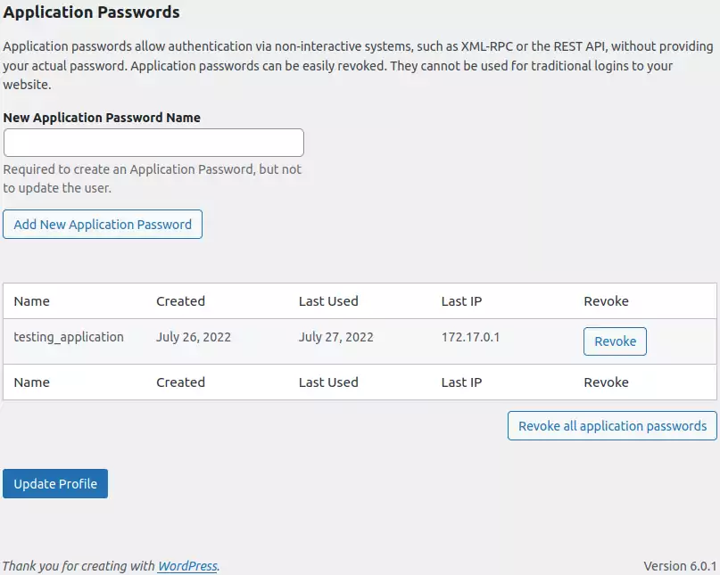

# WP API


I've been automating WordPress deployments for nearly a year now. Gives me
something to blog about. I'd had no cause to automate my non-existent
interactions with the web UI. To go beyond automating deployments and
add features I need to hook into WordPress functionality, and I'm not about
to learn PHP.

Enter application passwords:



## Usage

Create an application password from a user with the necessary privileges. See
the config.json used by tests and substitute fields. I don't use this on
production since I replicate mine from dev, but in theory you could.

I have an application already using this, [wp_img_compressor](
https://github.com/ployt0/wp_img_compressor).

Please also see the tests for real examples. Run them with:

```shell
cd /vagrant/tests
export PYTHONPATH=.. pytest
```


