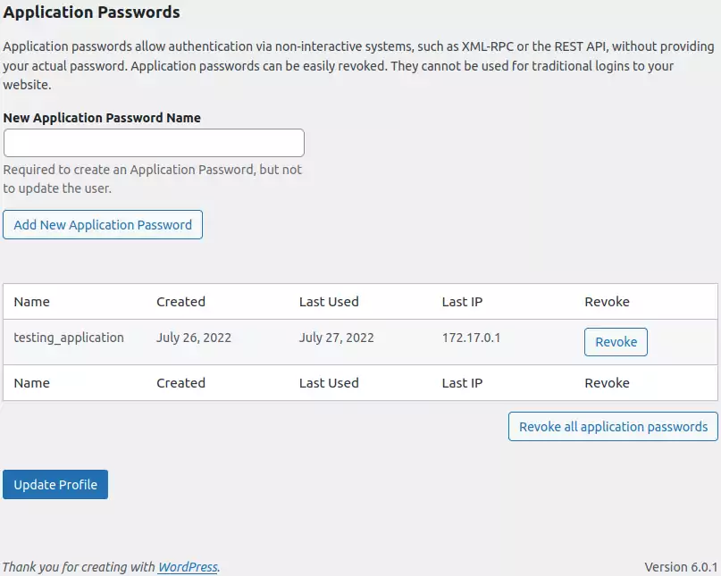

# WP Automations

I've been automating WordPress deployments for nearly a year now. Gives me
something to blog about. I'd had no cause to automate my non-existent
interactions with the web UI. To go beyond automating deployments and
add features I need to hook into WordPress functionality, and I'm not about
to learn PHP.

Enter application passwords.

## Usage

I have an application already using this, [wp_automations, which I should
rename to img_compressor](https://github.com/ployt0/wp_automations), now that
I am reliant on GitHub to run my tests.
